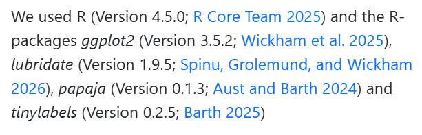

## Open Office Hours <br>(`r format(Sys.Date(),"%B %d, %Y")`) 

::: {layout="[[10,10],]"}
::: first-column
+ Recap session #121
+ Today's topic(s):
    + [[NCAA]{.ncaa} [tournament]{.ncaa2}<br>[brackets]{.ncaa2} ](https://github.com/elishayer/mRchmadness)
+ Shared problem-solving

:::

::: second-column

<br>
<br>
<br>
<br>
<br>
<br>

::: {.callout-note}
## Reminder -- check it out!! 
Fantastic [ resource!! ](https://qmd4sci.njtierney.com/) 
:::

:::

:::

::: {.absolute style="top: 185px; right: -120px; width:550px;"}
<a href="https://jtkulas.github.io/LiveStreams/slides/2026/3_17_26">
  
</a>
:::

{.absolute top="165" left="385" width="200"}

# Recap of Session <br>#121: 

{.absolute right="50" top="200"}

{.absolute width="150" top="245" right="90"}

## [`package`<br>[citations!!]{.dancing}](https://yihui.org/rmarkdown-cookbook/write-bib#write-bib)

::: {.panel-tabset}

### `knitr::`

::: {.columns .smaller}

::: {.column width="5%"}
:::

::: {.column width="55%"}

1. `write_bib()` creates .bib file (will overwrite existing)

2. `.packages()` is a hidden function that will include all loaded packages within the .bib

:::

::: {.column width="40%"}

````{r}
---
format: html
bibliography: packages.bib  #<1>
---

```{r}
knitr::write_bib(c(.packages(), 
      "ggplot2"), "packages.bib")  #<2>

```

````
1. should match name YOU provide (line #8 here)
2. `.packages()`, any non--loaded packages you want to include, & your .bib filename


:::

:::

{.absolute height="150" left="-150" top="150"}
 
{.absolute left="-130" bottom="150" height="180"}

### `papaja::`

::: {.columns}

::: {.column width="5%"}
:::

::: {.column width="45%"}

1. use [`cite_r()`](https://www.rdocumentation.org/packages/papaja/versions/0.1.4/topics/cite_r) for auto--population of in--text citations:

```{r}
We used `r cite_r("packages.bib")`

```

:::

::: {.column width="50%"}

:::

:::

{.absolute right="-120" bottom="160"}

{.absolute height="200" right="-60" bottom="0"}

{.absolute height="150" left="-150" top="150"}

{.absolute left="-130" bottom="150" height="180"}

### Other options

::: {.columns}

::: {.column width="5%"}
:::

::: {.column width="47%"}

### [`grateful`](https://pakillo.github.io/grateful/)

+ option for printed [table]{.underline} with a listing of [package name, version, & in--text citation](https://pakillo.github.io/grateful/#frequently-asked-questions)

:::

::: {.column width="48%"}

### [`pakret`](https://arnaudgallou.github.io/pakret/)

+ [appends]{.underline} package spex to first `.bib` specified in [YAML]{.ranchers2} `bibliography:` field

:::

:::

{.absolute height="150" left="-150" top="150"}

{.absolute left="-130" bottom="150" height="180"}

{.absolute right="-140" bottom="40" height="200"}

:::

{.absolute top="-40" right="50" height="230"}

{.absolute right="-120" top="100"  height="230"}
 
# Today...


## [[NCAA]{.ncaa} [tournament]{.ncaa2} [brackets]{.ncaa2}](https://github.com/alexkaechele/MMBracketR/blob/master/R/plotTourn.R) {background-image="https://library.sportingnews.com/styles/crop_style_16_9_desktop_webp/s3/2025-03/March%20Madness%20bracket%201.jpg.webp?itok=A5D7hrbC"}

::: {.absolute style="top: 210px; right: -120px; width: 500px;" .tilt2}
<a href="https://www.rdocumentation.org/packages/bracketeer/versions/0.1.1">
  
</a>
:::

::: {.absolute style="top: 210px; left: -120px; width: 500px;" .tilt}
<a href="https://github.com/zachmayer/kaggleNCAA">
  
</a>
:::

##  Session Info (`r format(Sys.Date(),"%B %d, %Y")`) Rendering:
```{r}
#| eval: true
#| echo: false
sessionInfo()
```
