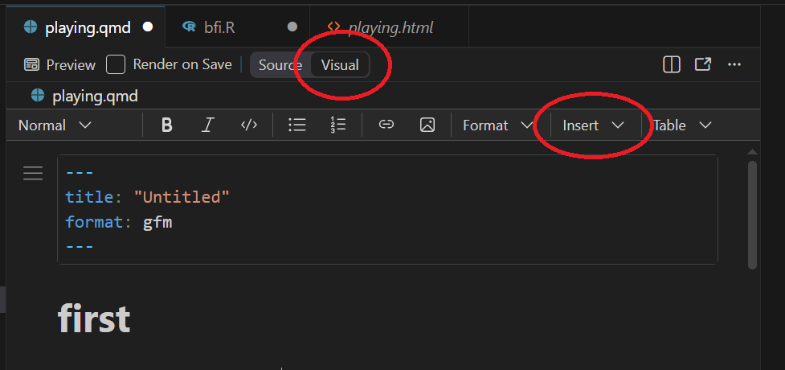

## Open Office Hours <br>(`r format(Sys.Date(),"%B %d, %Y")`) 

::: {layout="[[10,10],]"}
::: first-column
+ Recap session #121
+ Today's topic(s):
    + [`package`<br>[citations!!]{.dancing}](https://yihui.org/rmarkdown-cookbook/write-bib#write-bib)
+ Shared problem-solving

:::

::: second-column

<br>
<br>
<br>
<br>
<br>
<br>

::: {.callout-note}
## Reminder -- check it out!! 
Fantastic [ resource!! ](https://qmd4sci.njtierney.com/) 
:::

:::

:::

::: {.absolute style="top: 185px; right: -120px; width:550px;"}
<a href="https://jtkulas.github.io/LiveStreams/slides/2026/3_17_26">
  
</a>
:::

{.absolute top="165" left="385" width="200"}

# Recap of Session <br>#121: 

{.absolute right="50" top="200"}

{.absolute width="150" top="245" right="90"}

## [`package`<br>[citations!!]{.dancing}](https://yihui.org/rmarkdown-cookbook/write-bib#write-bib)

::: {.panel-tabset}

### `knitr::`

::: {.columns .smaller}

::: {.column width="5%"}
:::

::: {.column width="55%"}

1. `write_bib` creates .bib file (will overwrite existing)

2. `.packages()` is a hidden function that will include all loaded packages within the .bib^[you can also call--out specific packages if you'd like them included in the .bib file]

:::

::: {.column width="40%"}

````{r}
lorem ipsum lorem ipsum lorem ipsum 

```{r}
knitr::write_bib(c
    (.packages(), 
      "ggplot2"), 
    "packages.bib")

```
````

:::

:::

### `papaja::`

::: {.columns .smaller}

::: {.column width="55%"}

:::

::: {.column width="45%"}

Both have identical interface within the `visual` editor(s)

However -- Zotero [needs to be OPEN]{.underline} for Positron use -- R Studio will find entries regardless of whether Zotero is currently open or not

:::

:::

{.absolute left="-120" bottom="70" height="300"}

### Other options

::: {.columns}

::: {.column width="60%"}

1. Find desired style (use [Style Search](https://www.zotero.org/styles))
2. Click hyperlink to download
3. Place in project directory
4. Call out within [YAML]{.ranchers2} 

:::

::: {.column width="40%"}

::: {.callout-note}

10,840 styles listed on [Zotero Style Repository](https://www.zotero.org/styles)

:::

```{r}
#| code-line-numbers: "5"
---
title: "My Document"
format: pdf
bibliography: references.bib
csl: apa.csl                 #<1>
---
```
1. first--level specification unless using `format: typst` (see next tab)

:::

:::

:::

{.absolute top="-40" right="50" height="230"}

{.absolute right="-120" top="100"  height="230"}
 
{.absolute height="150" left="-150" top="150"}
 
{.absolute left="-130" bottom="150" height="180"}


# Today...


## [`package` [citations!!]{.dancing}](https://yihui.org/rmarkdown-cookbook/write-bib#write-bib)


::: {.columns .smaller}

::: {.column width="40%"}

### `knitr` functions

+ [`.packages()`](https://github.com/yihui/knitr/blob/master/R/defaults.R)
  + hidden ("dot" prefix)
+ [`write_bib()`](https://yihui.org/rmarkdown-cookbook/write-bib)
  + will overwrite existing .bib file
  + use separate .bib for "other" citations

:::

::: {.column width="30%"}

### structure

::: {.fragment .semi-fade-out fragment-index=1}

Chunk:

```{r}
knitr::write_bib(c
    (.packages(), 
      "ggplot2"), 
    "packages.bib")
```
:::

::: {.fragment .fade-in fragment-index=1}

[YAML]{.ranchers2}:

```{r}
#| code-line-numbers: "4"
---
title: "Untitled"
format: html
bibliography: packages.bib
---
```

:::

:::

::: {.column width="30%"}

### [other options](https://www.rdocumentation.org/packages/papaja/versions/0.1.4/topics/cite_r)

+ [`grateful`](https://pakillo.github.io/grateful/) 
+ [`pakret`](https://arnaudgallou.github.io/pakret/)

:::

:::

{.absolute right="-80" bottom="20" height="240"}

{.absolute right="-150" top="-40" height="220"}

{.absolute right="-130" top="250" height="180"}

{.absolute left="-170" top="125" height="150"}

{.absolute left="-120" bottom="300" height="150"}

{.absolute left="-170" bottom="165" height="150"}

{.absolute left="-120" bottom="20" height="170"}


##  Session Info (`r format(Sys.Date(),"%B %d, %Y")`) Rendering: 
```{r}
#| eval: true
#| echo: false
sessionInfo()
```

{.absolute right="-140" top="-30" height="300"}

{.absolute right="150" bottom="-20" height="350"}