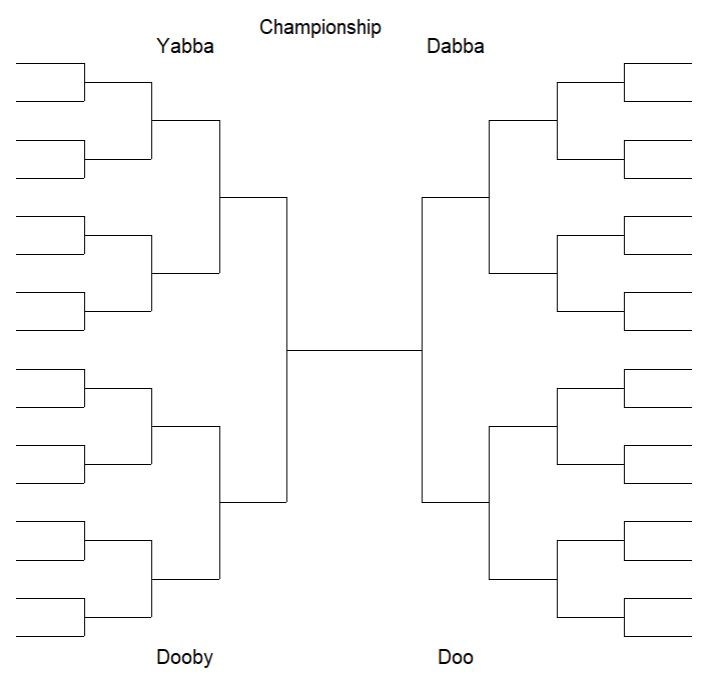
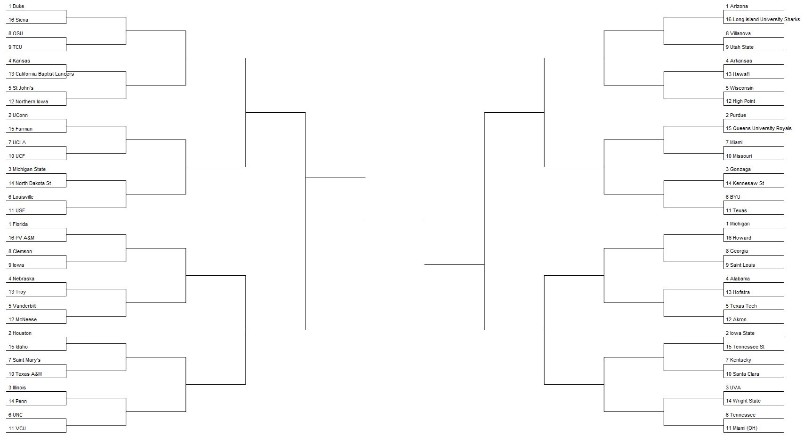

## Open Office Hours <br>(`r format(Sys.Date(),"%B %d, %Y")`) 

::: {layout="[[10,10],]"}
::: first-column
+ Recap session #122
+ Today's topic(s):
    + [[Text Animation]{.risque .biggeR}](https://github.com/mcanouil/quarto-animate)
+ Shared problem-solving

:::

::: second-column

<br>
<br>
<br>
<br>
<br>
<br>

::: {.callout-note}
## Reminder -- check it out!! 
Fantastic [ resource!! ](https://qmd4sci.njtierney.com/) 
:::

:::

:::

::: {.absolute style="top: 185px; right: -120px; width:550px;"}
<a href="https://jtkulas.github.io/LiveStreams/slides/2026/3_24_26">
  
</a>
:::

{.absolute top="165" left="385" width="200"}

# Recap of Session <br>#122: 

{.absolute right="50" top="200"}

{.absolute width="160" top="250" right="85"}

## [[NCAA]{.ncaa} [tournament]{.ncaa2} [brackets]{.ncaa2}](https://nypost.com/wp-content/uploads/sites/2/2023/03/printable-blank-ncaa-bracket-2023.jpg?resize=1200,927&quality=75&strip=all)

::: {.panel-tabset}

### Blank 

::: {.columns}

::: {.column width="50%"}

+ `plotTourn` function extracted from [`MMBracketR` package](https://github.com/alexkaechele/MMBracketR/blob/master/R/plotTourn.R) 

```{r}

## Rename "Regions"
## Specify # of teams

plotTourn(32)   #<1>

```
1. whatever number you'd like -- [NCAA]{.ncaa} has 64 teams (32 plotted here for simplicity of presentation)

:::

::: {.column width="50%"}

:::

:::

{.absolute right="0" bottom="60" height="400"}

### Populated 

::: {.columns}

::: {.column width="40%"}

+ [`mRchmadness` package](https://github.com/elishayer/mRchmadness) has many fun functions -- `vignettes(mRchmadness)` walks through a few

```{r}

library(mRchmadness)
vignettes(mRchmadness) #<1>

draw.bracket(bracket.empty=bracket.men.2026)  #<2>

```
1. good explanation of package purpose and capabilities
2. has both mens and womens' pre--populated brackets going back to the 2017 tournament

:::

::: {.column width="60%"}

:::

:::

{.absolute bottom="80" right="-150" height="350"}

### Run--yer--own 

::: {.columns}

::: {.column width="55%"}

+ [`bracketeer`](https://www.rdocumentation.org/packages/bracketeer/versions/0.1.1) intended for general tournament design & management
+ updating capability (you input game results as the tourney progresses)

:::

::: {.column width="45%"}

:::

:::

{.absolute right="-20" bottom="80"}

:::

# Today...


## 

Lots goin' on here... 

::: {.columns}

::: {.column width="33%"}

### Unadorned

```{r}

## shortcode:



```




:::

::: {.column width="34%"}

### Hyperlinked

```{r}

::: {.animate__animated .animate__bounce}

[Lookie Here!!](https://m.canouil.fr/quarto-animate/)

:::
  
```

::: {.animate__animated .animate__bounce}

[Lookie Here!!](https://m.canouil.fr/quarto-animate/)

:::

:::

::: {.column width="33%"}

### &nbsp;Fonts

```{r}

::: {.animate__animated .animate__flip}

[Lookie Here!!]{.risque .biggeR}

:::
  
```


::: {.animate__animated .animate__flip}

[Lookie Here!!]{.risque .biggeR}

:::

:::

:::

{.absolute right="-150" top="0" height="250"}

{.absolute left="-120" bottom="0" height="270"}

{.absolute right="250" top="-40" height="200"}

{.absolute height="170" right="420" bottom="20"}

##  Session Info (`r format(Sys.Date(),"%B %d, %Y")`) Rendering: 
```{r}
#| eval: true
#| echo: false
sessionInfo()
```
