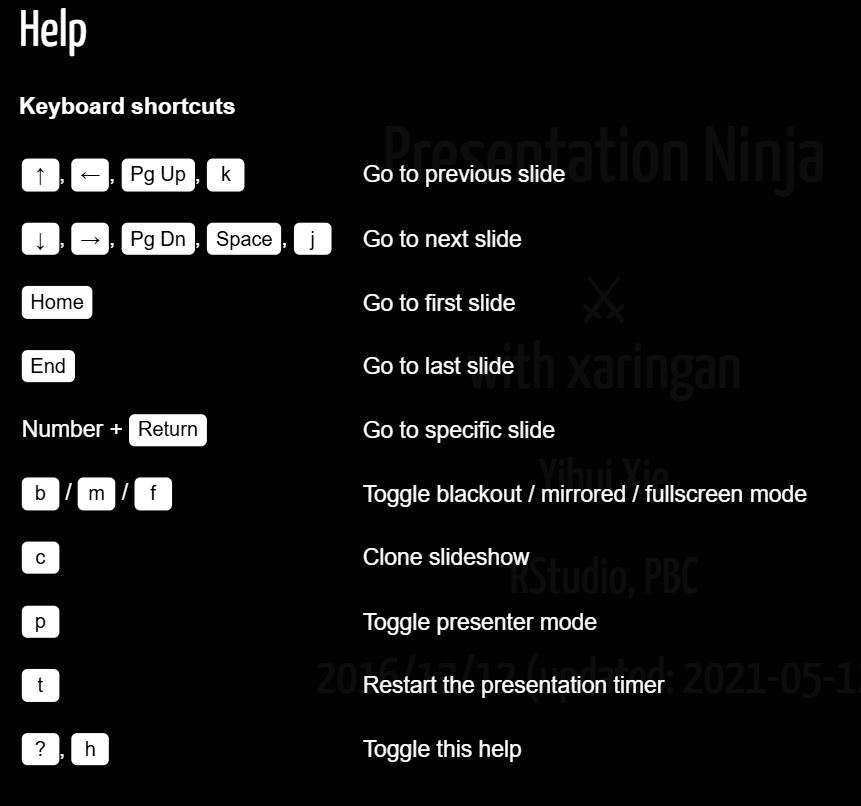

## Open Office Hours <br>(`r format(Sys.Date(),"%B %d, %Y")`) 

::: {layout="[[10,10],]"}
::: first-column
+ Recap session #118
+ Today's topic(s):
    + [[YAML]{.ranchers2 .Bigger}](https://quarto.org/docs/authoring/front-matter.html)
+ Shared problem-solving

:::

::: second-column

<br>
<br>
<br>
<br>
<br>
<br>

::: {.callout-note}
## Reminder -- check it out!! 
Fantastic [ resource!! ](https://qmd4sci.njtierney.com/) 
:::

:::

:::

::: {.absolute style="top: 185px; right: -120px; width:550px;"}
<a href="https://jtkulas.github.io/LiveStreams/slides/2026/2_24_26">
  
</a>
:::

{.absolute top="165" left="385" width="200"}

# Recap of Session <br>#118: 

{.absolute right="50" top="200"}

{.absolute width="210" top="215" right="70"}

## [[[Xaringan!!]{.xaringandon}](https://github.com/yihui/xaringan)]{.Bigger}

::: {.panel-tabset}

### [YAML]{.ranchers2}

::: {.columns}

::: {.column width="30%"}

<iframe src="https://slides.yihui.org/xaringan/#1" width="100%" height="350">
</iframe>

:::

::: {.column width="60%"}

```{r}
---
title: "Presentation Ninja"
subtitle: "⚔<br/>with xaringan"
author: "Yihui Xie"
institute: "RStudio, PBC"
date: "2016/12/12 (updated: `r Sys.Date()`)"
output:
  xaringan::moon_reader:
    lib_dir: libs                     #<1>
    nature:                           #<2>
      highlightStyle: github          #<3>
      highlightLines: true            #<3>
      countIncrementalSlides: false   #<4>
---
```
1. helps make presentation self--contained by creating folder with necessary files when you knit  (generally considered good practice)
2. slide behavior often specified here, under `nature` "sub--key" (for example, `autoplay` -- for more info, see [`?xaringan::moon_reader`](https://www.rdocumentation.org/packages/xaringan/versions/0.30/topics/moon_reader))
3. refers to code highlighting (not hyperlinks)
4. should fragments (`--` characters) be counted as separate slides or not within the slide counter

:::

:::

### Formatting 

::: {.columns}

::: {.column width="10%"}
:::

::: {.column width="45%"}

#### [Xaringan:]{.xaringanraf}

```
.effect[
content being affected
]

```
:::

::: {.column width="45%"}

#### Quarto/RevealJS:

```
[content being affected]{.effect}

OR, alternatively...

::: {.effect}

content being affected

:::

```

:::

:::

### Shortcut keys   

::: {.columns}

::: {.column width="13%"}
:::

::: {.column width="40%"}

::: {.callout-note}

Pressing `h` from anywhere *while [within the presentation](https://slides.yihui.org/xaringan/#1)* (as you are  navigating) reveals default shortcut keys & effects

:::

:::

::: {.column width=47%"}
:::

:::

{.absolute height=400 right="15" bottom="0"}

{.absolute bottom="20" left="380" height="120" .tilt}

### Extensions

::: {.columns .smaller}

::: {.column width="10%"}
:::

::: {.column width="45%"}

`xaringanExtra`: 

+ [additional capabilities](https://pkg.garrickadenbuie.com/xaringanExtra/#/?id=xaringanextra) that do not come bundled with "base" `xaringan`
+ activated [within code blocks](https://github.com/gadenbuie/xaringanExtra/?tab=readme-ov-file#xaringanextra) (not YAML)

:::

::: {.column width="45%"}

[`xaringanthemer`](https://pkg.garrickadenbuie.com/xaringanthemer/):  

+ takes care of (color & font) [css stylings for you](https://pkg.garrickadenbuie.com/xaringanthemer/articles/xaringanthemer.html)  
+ called out within YAML, but [activated/specified within code chunk](https://pkg.garrickadenbuie.com/xaringanthemer/#quick-intro)

:::

:::

:::

{.absolute height="250" top="0" right="-150" .mirror}

{.absolute height="250" top="-10" right="200"}

{.absolute height="250" top="-10" left="300" .mirror}

{.absolute height="250" left="-200" top="-40"}

{.absolute height="300" left="-170" bottom="0"}

# Today...


## [[YAML]{.ranchers2 .bigger}](https://quarto.org/docs/authoring/front-matter.html) [[(YAML Ain't Markup Language...)]{.ranchers2 .smaller}](https://github.com/yaml/)

::: {.columns .smaller}

::: {.column width="50%" .fragment .semi-fade-out fragment-index=1}

### Generally:

+ cross-language [serialized data format](https://yaml.org/) 
  + [where it began](https://yaml.com/blog/in-the-beginning/)
  + currently [YAML 1.2.2](https://yaml.org/spec/1.2.2/)
+ tutorial 1: [](https://learnxinyminutes.com/yaml/), tutorial 2: [](https://www.cloudbees.com/blog/yaml-tutorial-everything-you-need-get-started)
+ beginner's guide 1: [](https://circleci.com/blog/what-is-yaml-a-beginner-s-guide/), beginner's guide 2: [](https://www.redhat.com/en/topics/automation/what-is-yaml)

:::

::: {.column width="50%" .fragment fragment-index=1}

### Quarto/ RMarkdown:

Provides "meta" structure to be applied to entire rendered document (layout, fonts, format, stylings, etc)

+ [Quarto YAML](https://quarto-tdg.org/yaml)

:::

:::

{.absolute right="480" bottom="20" height="150"}

{.absolute left="-160" top="-10" height="300"}

{.absolute bottom="-10" right="-20" height="250"}

{.absolute right="-150" top="10" height="350" .mirror}

{.absolute left="-160" bottom="0" height="200"}

##  Session Info (`r format(Sys.Date(),"%B %d, %Y")`) Rendering: 
```{r}
#| eval: true
#| echo: false
sessionInfo()
```

## [YAML Whazzat?!?]{.ranchers2 .bigger}

Grok response (3/3/26):

::: {.columns}

::: {.column width="35%"}

::: {.callout-tip}

## Query:

"I use YAML within Quarto and R Markdown documents. What are some other uses for YAML (please explain using non-technical jargon - e.g., to someone unfamiliar with computer languages)"

:::

:::

::: {.column width="65%"}

<iframe 
  src="https://jtkulas.github.io/LiveStreams/slides/2026/3_3_26/grok.html" 
  width="100%" 
  style="height: 75vh; border: none;"
  allowfullscreen>
</iframe>

:::

:::