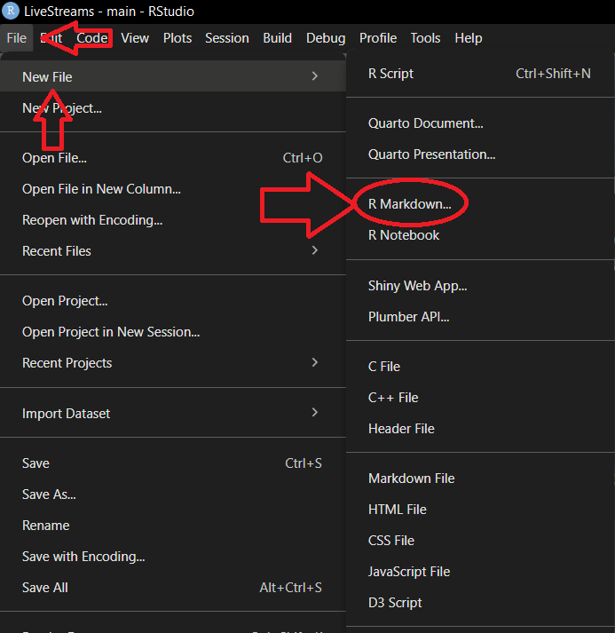
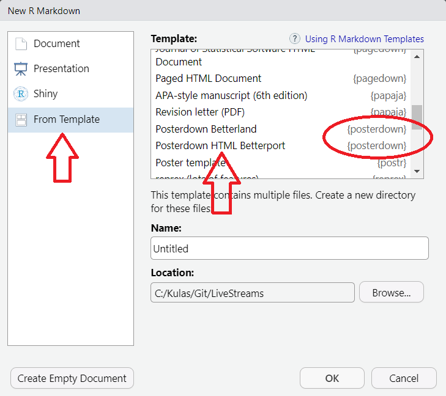

## Open Office Hours <br>(`r format(Sys.Date(),"%B %d, %Y")`) 

::: {.columns}
::: {.column width="55%"}
+ Recap session #124
+ Today's topic(s):
    + [[Conference Posters (II)]{.revolt .bigger}](https://colinpurrington.com/tips/poster-design/)
+ Shared problem-solving

::: {.callout-note}
## Reminder -- check it out!! 
Fantastic [ resource!! ](https://qmd4sci.njtierney.com/) 
:::

:::

::: {.column width="45%"}

:::

:::

::: {.absolute style="top: 185px; right: -120px; width:550px;"}
<a href="https://jtkulas.github.io/LiveStreams/slides/2026/4_7_26">
  
</a>
:::

{.absolute top="165" left="385" width="200"}

# {background-image="https://media1.giphy.com/media/v1.Y2lkPTc5MGI3NjExOG5wMDRnYnl3bGZiMzVsMG94OHF0MWVqaHQ2ZTVqYnlxNGtraHVrMSZlcD12MV9pbnRlcm5hbF9naWZfYnlfaWQmY3Q9Zw/eTWOi2fWRCwTNqVJQo/giphy.gif" background-size="1000px"}

##  New Quarto Version!! 

::: {.columns}

::: {.column width="60%"}

+ [1.9.37](https://quarto.org/docs/blog/posts/2026-03-24-1.9-release/) -- released 4/9/26
+ [LLM accomodation for websites](https://quarto.org/docs/websites/website-llms.html)
+ [new table specification](https://quarto.org/docs/blog/posts/2026-03-24-1.9-release/#list-tables) (alternative to )

:::

::: {.column width="40%"}


+ more/improved typst support/integration

<br>

::: {.callout-note}

Kulas only realized because this week's poster template had a Quarto version requirement of > 1.9  

:::

:::

:::

{.absolute left="120" bottom="10" height="300"}

# Recap of Session <br>#124: 

{.absolute right="50" top="200"}

{.absolute width="170" top="250" right="85"}

{.absolute width="70" top="270" right="135"}

## [[Conference Posters ()]{.revolt .bigger}](https://colinpurrington.com/tips/poster-design/)

::: {.columns}

::: {.column width="50%"}

[`posterdown`](https://github.com/brentthorne/posterdown) & [`pagedown`](https://github.com/rstudio/pagedown?tab=readme-ov-file#posters) both capitalize on  transformation via `pagedown::chrome_print()`

1. specify desired dimensions
2. add extra YAML spex

:::

::: {.column width="50%"}

```{r}
#| code-line-numbers: "18-21"
---
title: Generate Reproducible & Live HTML and PDF Conference Posters Using RMarkdown
author:
  - name: Brent Thorne
    affil: 1
    orcid: '0000-0002-1099-3857'
affiliation:
  - num: 1
    address: Department of Earth Science, Brock University Canada
column_numbers: 3
logoright_name: https&#58;//www.pngkey.com/png/full/380-3806364_chilly-willy-the-penguin.png
logoleft_name: https&#58;//raw.githubusercontent.com/brentthorne/posterdown/master/images/betterhexlogo.png
primary_colour: "#60c0e6"
secondary_colour: "#1c4859"
accent_colour: "#d986d5"
output: 
  posterdown::posterdown_html:
    poster_height: "36in"      #<1>
    poster_width: "48in"       #<1>
    self_contained: true       #<2>
knit: pagedown::chrome_print 
bibliography: packages.bib
---
```
1. check with printer prior to size specification -- works as first--level YAML command as well (if you run into issues)
2. default is `self_contained: false` -- has consequences for any external resource requirements. Setting to `true` eliminates external resource dependencies

:::

:::

{.absolute bottom="15" left="150" height="200" .tilt}

{.absolute bottom="0" left="-150" height="225"}

{.absolute top="-50" right="-150" height="200"}

## [[Conference Posters (II -- How)]{.revolt .bigger}](https://colinpurrington.com/tips/poster-design/)

::: {.columns}

::: {.column width="5%"}
:::

::: {.column width="50%"}

[1. install `pagedown` & `posterdown`]{.fragment .semi-fade-out fragment-index=1}  

[2. `File``New File``R Markdown`]{.fragment .fade-in-then-semi-out fragment-index=1}  

[3. `From Template`your preference -- choose from 3 `posterdown` & 2 `pagedown` poster templates]{.fragment .fade-in-then-semi-out fragment-index=2}

:::

::: {.column width="5%"}

:::

::: {.column width="40%" .fragment .fade-out fragment-index=1}

```{r}

## Available on CRAN:

install.packages("pagedown")

## Choose only 1 of the following:

remotes::install_github("brentthorne/posterdown")  #<1>
pak::pak("brentthorne/posterdown")  #<2>

```
1. core function that `devtools` has traditionally used (borrowed from `remotes`), however, `devtools` has depreciated `install_*()` functions and now recommends using `pak`
2. currently recommended as the most efficient way to install from 

:::

:::

[{.absolute right="-80" bottom="30" height="550"}]{.fragment .fade-in-then-out fragment-index=1}
[{.absolute right="-120" bottom="60" height="500"}]{.fragment .fade-in-then-out fragment-index=2}

{.absolute top="130" left="-150" height="200"}

{.absolute bottom="0" left="-150" height="225"}

# Today...


## [[Conference Posters (II)]{.revolt .bigger}](https://colinpurrington.com/tips/poster-design/) 

::: {.columns}

::: {.column width="55%"}

::: {.fragment .semi-fade-out}

###  Options:

::: {.Smaller}

+ [`posterdown`](https://github.com/brentthorne/posterdown/wiki) -- /CRAN archive, css--modified with .pdf capability via `pagedown:: chrome_print()`

+ [`poster_relaxed`](https://pagedown.rbind.io/poster-relaxed) & [`poster_jacobs`](https://pagedown.rbind.io/poster-jacobs) via [`pagedown`](https://github.com/rstudio/pagedown)

+ [`postr`](https://github.com/odeleongt/postr) -- flexdashboard with [webshot](https://wch.github.io/webshot/articles/intro.html) to .png (possibly )

+ $\LaTeX$ templates ([`beamerposter`]( https://github.com/deselaers/latex-beamerposter); [`tikzposter`](ttps://ctan.org/pkg/tikzposter); [`a0poster`](https://ctan.org/pkg/a0poster)) -- specify `template:` within [YAML]{.ranchers2}

:::

:::

:::

::: {.column width="45%"}

###  Options:

::: {.Smaller}

+ [Typst template](https://github.com/quarto-ext/typst-templates/tree/main/poster) -- built--in to base distribution (1.4+)

+ [quarto_poster](https://github.com/higgi13425/quarto_poster) -- [will need to fork]{.underline}  repo (not an extension)

+ User templates ([peace-of-posters](https://github.com/jonaspleyer/peace-of-posters); [typst-poster](https://github.com/pncnmnp/typst-poster)) -- specify `template.typ` or `quarto use template`

:::

:::

:::

::: {.absolute style="top: -30px; right: -130px; width:300px;"}
<a href="https://github.com/DiegoFigueiras/SIOP2022_POSTER/blob/main/index.pdf">
  
</a>
:::

::: {.absolute style="bottom: 255px; left: -180px; width:220px;"}
<a href="https://renatagppr93.github.io/SIOP2022/">
  
</a>
:::

##  Session Info (`r format(Sys.Date(),"%B %d, %Y")`) Rendering: 
```{r}
#| eval: true
#| echo: false
sessionInfo()
```
