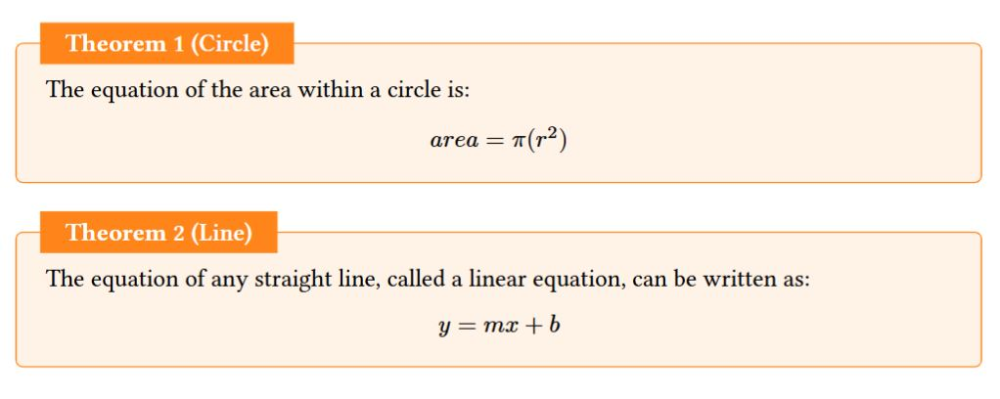
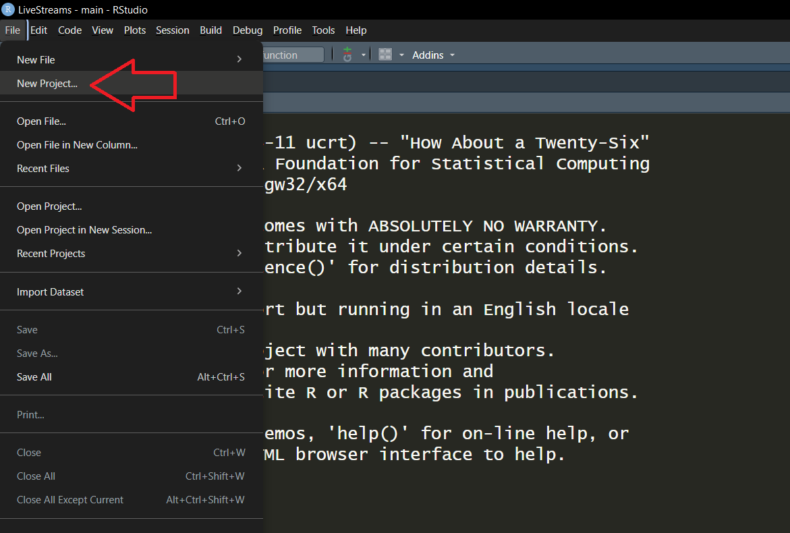
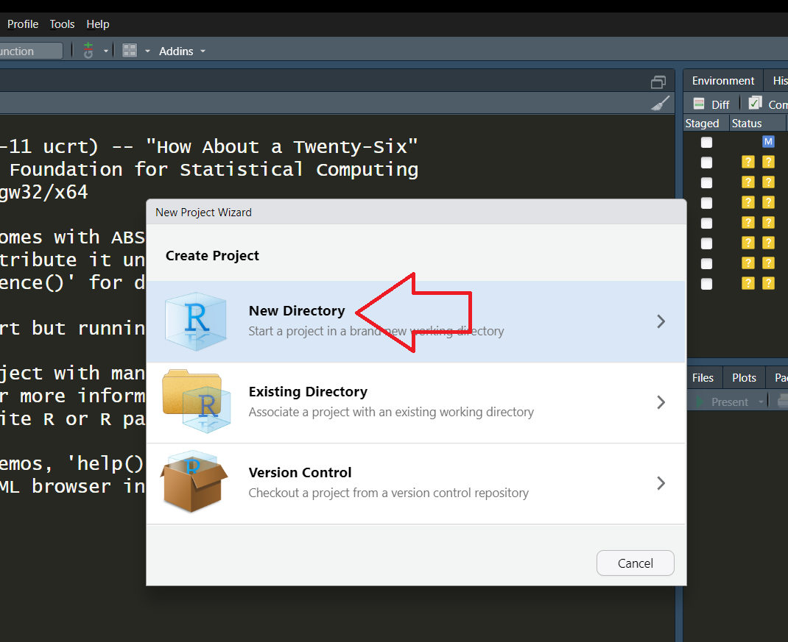
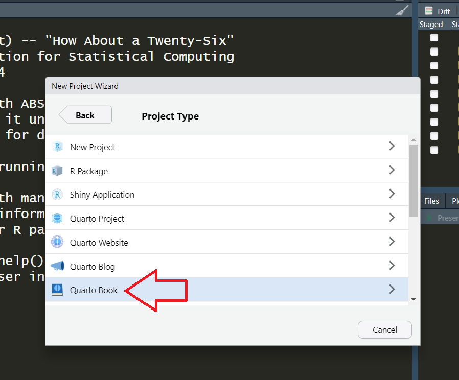
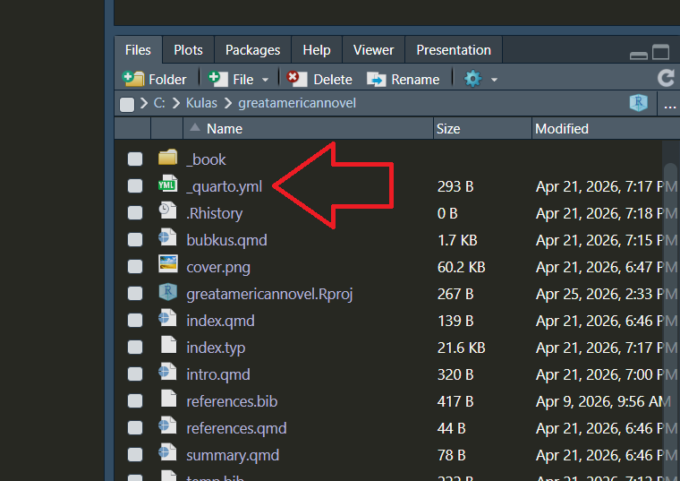

## Open Office Hours <br>(`r format(Sys.Date(),"%B %d, %Y")`) 

::: {.columns}
::: {.column width="55%"}
+ Recap session #126
+ Today's topic(s):
    + [[Publishing via Posit<br>Connect Cloud ]{.positron .bigger}](https://quarto.org/docs/blog/posts/2026-03-24-1.9-release/#publish-to-posit-connect-cloud)
+ Shared problem-solving

:::

::: {.column width="45%"}

<br>
<br>
<br>
<br>
<br>

::: {.callout-note}
## Reminder -- check it out!! 
Fantastic [ resource!! ](https://qmd4sci.njtierney.com/) 
:::

:::

:::

::: {.absolute style="top: 170px; right: -120px; width:550px;"}
<a href="https://jtkulas.github.io/LiveStreams/slides/2026/4_21_26">
  
</a>
:::

{.absolute top="165" left="385" width="200"}

# Recap of Session <br>#126: 


## [[new `typst` capabilities]{.typst}](https://quarto.org/docs/blog/posts/2026-03-24-1.9-release/#improvements-to-typst-support)

::: {.panel-tabset}

### Theorems 

::: {.columns}

::: {.column width="55%"}

4 template appearances: [`simple`, `fancy`, `clouds`, `rainbow`](https://quarto.org/docs/output-formats/typst.html#theorems) 

:::

::: {.column width="45%"}

````{r}
#| code-line-numbers: "4"
---
format:
  typst:
    theorem-appearance: fancy   #<1>
---
  
::: {#thm-circle}

## Circle

The equation of the area within a circle is:

$$
area = \pi(r^{2})
$$
:::

::: {#thm-line}

## Line

The equation of any straight line, called a linear equation, can be written as:

$$
y = mx + b
$$
:::

````
1. "fancy" value will inheret color scheme (if have [`_brand.yml` specified](https://quarto.org/docs/authoring/brand.html))

:::

:::

[]{.absolute left="-100" bottom="0" height="290"}

### Books   

::: {.columns}

::: {.column width="55%"}

[1. `File``New Project`]{.fragment .semi-fade-out fragment-index=1}  

[2. `New Directory`]{.fragment .fade-in-then-semi-out fragment-index=1}  

[3. `Quarto Book` (choose folder & save when prompted)]{.fragment .fade-in-then-semi-out fragment-index=2}

[4. Look in your project directory(`_quarto.yml`)]{.fragment .fade-in-then-semi-out fragment-index=3}

:::

::: {.column width="45%"}

:::

:::

[{.absolute right="-80" bottom="30" height="400"}]{.fragment .fade-out fragment-index=1}
[{.absolute right="-20" bottom="50" height="400"}]{.fragment .fade-in-then-out fragment-index=1}
[{.absolute right="-40" bottom="50" height="400"}]{.fragment .fade-in-then-out fragment-index=2}
[{.absolute right="-90" bottom="50" height="400"}]{.fragment .fade-in-then-out fragment-index=3}

### Margins 

:::

{.absolute right="-130" top="-40" height="250"}

# Today...


## [[Publishing via Posit Connect Cloud ]{.positron .bigger}](https://quarto.org/docs/publishing/posit-connect-cloud.html)

::: {.absolute style="top: 140px; left: 280px; width:950px;"}
<a href="https://quarto.org/docs/websites/">
  
</a>
:::

::: {.absolute style="bottom: 30px; right: -50px; width:350px;"}
<a href="https://carpentries-incubator.github.io/targets-workshop/quarto.html">
  
</a>
:::

::: {.absolute style="bottom: 50px; left: -100px; width:550px;"}
<a href="https://quarto.org/docs/dashboards/">
  
</a>
:::

{.absolute top="100" left="-110" height="230"}

##  &  Session Info (`r format(Sys.Date(),"%B %d, %Y")`) Rendering: 

::: {.columns}

::: {.column width="80%"}
```{r}
#| echo: false
#| eval: true
sessionInfo()
```
:::

::: {.column width="20%"}

Quarto version `r quarto::quarto_version()`

:::

:::

