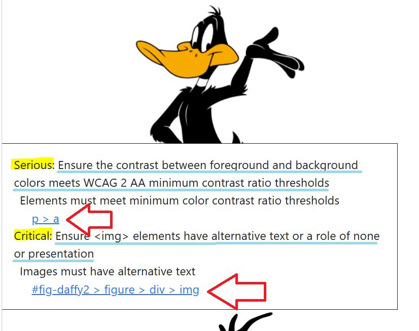

## Open Office Hours <br>(`r format(Sys.Date(),"%B %d, %Y")`) 

::: {.columns}
::: {.column width="55%"}
+ Recap session #129
+ Today's topic(s):
    + [[]{.bigger} [Shortcodes!!]{.syncopate}<br>``](https://quarto.org/docs/authoring/shortcodes.html)
+ Shared problem-solving

:::

::: {.column width="45%"}

<br>
<br>
<br>
<br>
<br>

::: {.callout-note}
## Reminder -- check it out!! 
Fantastic [ resource!! ](https://qmd4sci.njtierney.com/) 
:::

:::

:::

::: {.absolute style="top: 170px; right: -120px; width:550px;"}
<a href="https://jtkulas.github.io/LiveStreams/slides/2026/5_12_26">
  
</a>
:::

{.absolute top="165" left="385" width="200"}

# Recap of Session <br>#129: 

{.absolute right="100"}

{.absolute top="285" right="115" height="200"}

## [[Presentation Accessibility Enhancements!!]{.nostress}[]{.bigger}](https://github.com/mcanouil/quarto-revealjs-a11y)

::: {.panel-tabset}

### built--in 

::: {.columns}

::: {.column width="19%"}

:::

+ [`axe-core`](https://quarto.org/docs/output-formats/html-accessibility.html) testing
+ [alt text](https://quarto.org/docs/authoring/figures.html#alt-text) (images)
+ [slide--tone](https://quarto.org/docs/presentations/revealjs/presenting.html#slide-tone)
+ [web--standards](https://developer.mozilla.org/en-US/docs/Learn_web_development/Getting_started/Web_standards/The_web_standards_model) built

:::

{.absolute right="-30" bottom="0" height="350"}

{.absolute left="-130" bottom="40" height="300"}

### `a11y` extension 

::: {.columns}

::: {.column width="18%"}

+ [Description](https://github.com/mcanouil/quarto-revealjs-a11y#revealjs-a11y)
+ [Options](https://github.com/mcanouil/quarto-revealjs-a11y#options)
+ [Shortcuts](https://github.com/mcanouil/quarto-revealjs-a11y#options)
+ [Installation](https://github.com/mcanouil/quarto-revealjs-a11y#installation)

::: 

::: {.column width="18%"}

:::

::: {.column width="60%"}

<iframe
src="https://m.canouil.dev/quarto-revealjs-a11y/#/title-slide"
width="600"
height="350"
style="border:none;">
</iframe>

:::

:::

:::

{.absolute right="-110" top="135" height="100"}

# Today...


## [[]{.bigger} [Shortcodes!!]{.syncopate}](https://quarto.org/docs/authoring/shortcodes.html)

<br>

+ Structure is ``  
+ entire `{}` is referred to as a "[shortcode](https://github.com/quarto-dev/quarto-shortcodes)"

::: {.smaller}
::: {.list-table tbl-colwidths="[40,35,25]"}

- - [shortcode]{.underline}:
  - [description]{.underline}:
  - [rendered]{.underline}:

- - `{}`
  - title as specified in YAML
  
  -  
  
- - `{}`
  - Quarto version
  
  -  

:::
:::

{.absolute right="-10" top="-40" height="250"}

{.absolute left="-150" top="140" height="200" .mirror}

##  &  Session Info (`r format(Sys.Date(),"%B %d, %Y")`) Rendering: 

::: {.columns}

::: {.column width="80%"}
```{r}
#| echo: false
#| eval: true
sessionInfo()
```
:::

::: {.column width="20%"}

Quarto version `r quarto::quarto_version()`  

:::

:::

