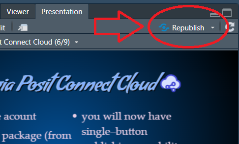

## Open Office Hours <br>(`r format(Sys.Date(),"%B %d, %Y")`) 

::: {.columns}
::: {.column width="55%"}
+ Recap session #127
+ Today's topic(s):
    + [[List Tables!!]{.bangers}](https://quarto.org/docs/blog/posts/2026-03-24-1.9-release/#list-tables)
+ Shared problem-solving

:::

::: {.column width="45%"}

<br>
<br>
<br>
<br>
<br>

::: {.callout-note}
## Reminder -- check it out!! 
Fantastic [ resource!! ](https://qmd4sci.njtierney.com/) 
:::

:::

:::

::: {.absolute style="top: 170px; right: -120px; width:550px;"}
<a href="https://jtkulas.github.io/LiveStreams/slides/2026/4_28_26">
  
</a>
:::

{.absolute top="165" left="385" width="200"}

# Recap of Session <br>#127: 

{.absolute right="100"}

{.absolute top="320" right="115" height="140"}

## [[Publishing via Posit Connect Cloud ]{.positron .bigger}](https://quarto.org/docs/publishing/posit-connect-cloud.html)

::: {.columns}

::: {.column width="55%"}

+ [sign--up](https://connect.posit.cloud/) for free acount 
+ use `rsconnect` package (from within ) to connect 
+ within console, run `rsconnect::connectCloudUser()`
  + this will walk you through authentication

:::

::: {.column width="45%"}

+ you will now have single--button publishing capability:

:::

:::

{.absolute right="-120" bottom="50"}

{.absolute bottom="50" left="-150" height="200"}

# Today...


## [[List Tables!!]{.bangers}](https://quarto.org/docs/blog/posts/2026-03-24-1.9-release/#list-tables)

::: {.columns}

::: {.column width="40%"}

Combine different object types within the same table -- permits complex mashups:  

+ e.g., code blocks alongside "normal" table elements


:::

::: {.column width="60%"}

::: {.list-table}
- - Function
  - Description

- - `sum()`
  - Adds values:

    ```r
    sum(1, 2, 3)
    ```

- - `nrow()`
  - Number of rows:

    - e.g., dataframes
    - `ncol()` for width

:::

:::

:::

{.absolute right="-120" top="-70"}

##  &  Session Info (`r format(Sys.Date(),"%B %d, %Y")`) Rendering: 

::: {.columns}

::: {.column width="80%"}
```{r}
#| echo: false
#| eval: true
sessionInfo()
```
:::

::: {.column width="20%"}

Quarto version `r quarto::quarto_version()`

:::

:::

