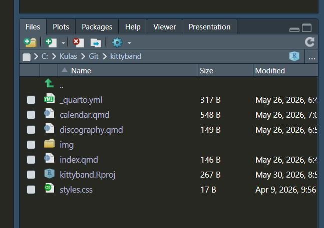
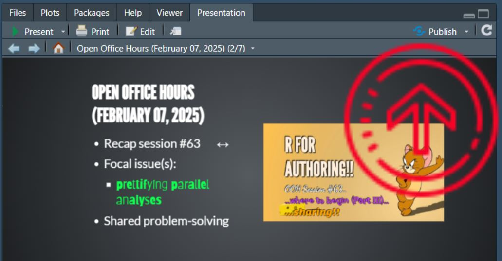

## Open Office Hours <br>(`r format(Sys.Date(),"%B %d, %Y")`) 

::: {.columns}
::: {.column width="55%"}
+ Recap session #131
+ Today's topic(s):
    + [[Accordion folding]{.frijole}](https://github.com/royfrancis/quarto-accordion)
+ Shared problem-solving

:::

::: {.column width="45%"}

<br>
<br>
<br>
<br>
<br>

::: {.callout-note}
## Reminder -- check it out!! 
Fantastic [ resource!! ](https://qmd4sci.njtierney.com/) 
:::

:::

:::

::: {.absolute style="top: 170px; right: -120px; width:550px;"}
<a href="https://jtkulas.github.io/LiveStreams/slides/2026/5_26_26">
  
</a>
:::

{.absolute top="165" left="385" width="200"}

# Recap of Session <br>#131: 

{.absolute right="100"}

{.absolute top="280" right="115" height="210"}

## [[building a website!!]{.bangers2 .biggeR}](https://quarto.org/docs/websites/)

::: {.panel-tabset}

### Project set--up 

::: {.Smaller}

Typical website structured as several different .qmd files -- easiest to manage from [within a project folder](https://martinctc.github.io/blog/rstudio-projects-and-working-directories-a-beginner%27s-guide/)

::: {.columns}

::: {.column width="65%"}

 wizard (version 2024.12.1; Build 563) only provides template files if you follow the `New Project...`  `New Directory` path  

+ `Existing Directory` & `Version Control` paths do not provide "Quarto Website" template option (no biggie)

:::

::: {.column width="35%"}
:::

:::

:::

{.absolute right="-70" bottom="40" height="300"}

### `_quarto.yml` 

::: {.columns}

::: {.column width="55%"}

```{r}
project:
  type: website
  output-dir: docs     #<1>

website:
  title: "Kitty Wampas"
  navbar:              
    logo: "img/wampa.png"         #<2>
    left:
      - href: index.qmd
        text: Home
      - href: discography.qmd
        text: Discography
      - calendar.qmd
      - contact.qmd               #<2>
    tools:                        #<3>
      - icon: github
        menu:
          - text: Source Code
            href: https://github.com/jtkulas/kittywampas
          - text: Report an Issue
            href: https://github.com/jtkulas/kittywampas/issues
      - icon: facebook
        href: https://facebook.com
      - icon: twitter-x
        href: https://x.com
      - icon: youtube
        href: https://www.youtube.com/@Kittywampas1     #<3>
  page-footer:  
    border: true
    center: "no Kitties or Wampas were harmed during the making of this band"
    left: "©Kitty Wampas 2026"
    right: 
      - text: "contact us"
        href: contact.qmd
    
format:
  html:
    mainfont: Zen Dots              #<4>
    theme:
      light: flatly                 #<5>
      dark: darkly                  #<5>
    css: styles.css
    toc: true
    
    
#    
```
1. Important for publishing with GitHub -- not necessary if publishing to Posit Connect Cloud
2. Navigation content & page ordering specified here
3. Right--hand navbar content specified here
4. Affects majority of content displayed on page -- best practice is to also provide backup fonts (to be used if yours isn't findable by a browser)
5. Specifying both `light:` and `dark:` gives you the navbar toggle

:::

::: {.column width="45%"}

"overarching" YAML specifications that bind separate .qmd files into one coherent product (most commonly a book or website)

:::

:::

### Publishing

::: {.columns}

::: {.column width="60%"}

Published to [Posit Connect Cloud](https://jtkulas-kittyband.share.connect.posit.cloud/) on the stream -- moved to [GitHub](https://jtkulas.github.io/kittywampas/) after the stream  

  + updated site [font](https://fonts.google.com/specimen/Zen+Dots?preview.script=Latn)
  + added [social media links](https://quarto.org/docs/websites/website-navigation.html#navbar-tools)
  + [DT](https://rstudio.github.io/DT/) table [songs list](https://jtkulas.github.io/kittywampas/discography.html#songs-played)

:::

::: {.column width="40%"}

:::

:::

{.absolute right="-150" bottom="80" height="300"}

:::

{.absolute right="-120" top="-40" height="300"}

# Today...


## [[Accoridion folding]{.frijole}](https://github.com/royfrancis/quarto-accordion)

::: {.columns}

::: {.column width="40%"}

Same concept as<br>[code--folding](https://quarto.org/docs/output-formats/html-code.html#folding-code):^[...also [callout blocks](https://quarto.org/docs/authoring/callouts.html#collapse)]

```{r}
#| eval: true
#| code-fold: true
#| code-summary: "Show the code"

# assign values
x <- 10.5
y <- 55

z <- x + y

# show the value 
z

```

:::

::: {.column width="60%" .smaller}

<br>




:::

:::

{.absolute right="-150" top="-40" height="225"}

##  &  Session Info (`r format(Sys.Date(),"%B %d, %Y")`) Rendering: 

::: {.columns}

::: {.column width="80%"}
```{r}
#| echo: false
#| eval: true
sessionInfo()
```
:::

::: {.column width="20%"}

Quarto version `r quarto::quarto_version()`  

:::

:::

